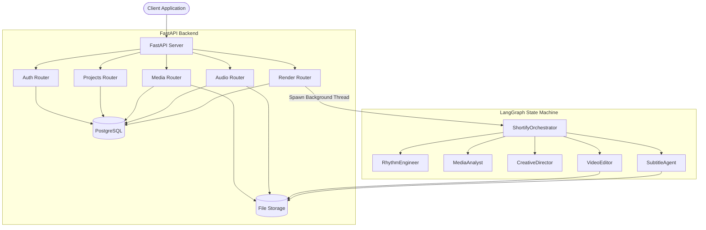
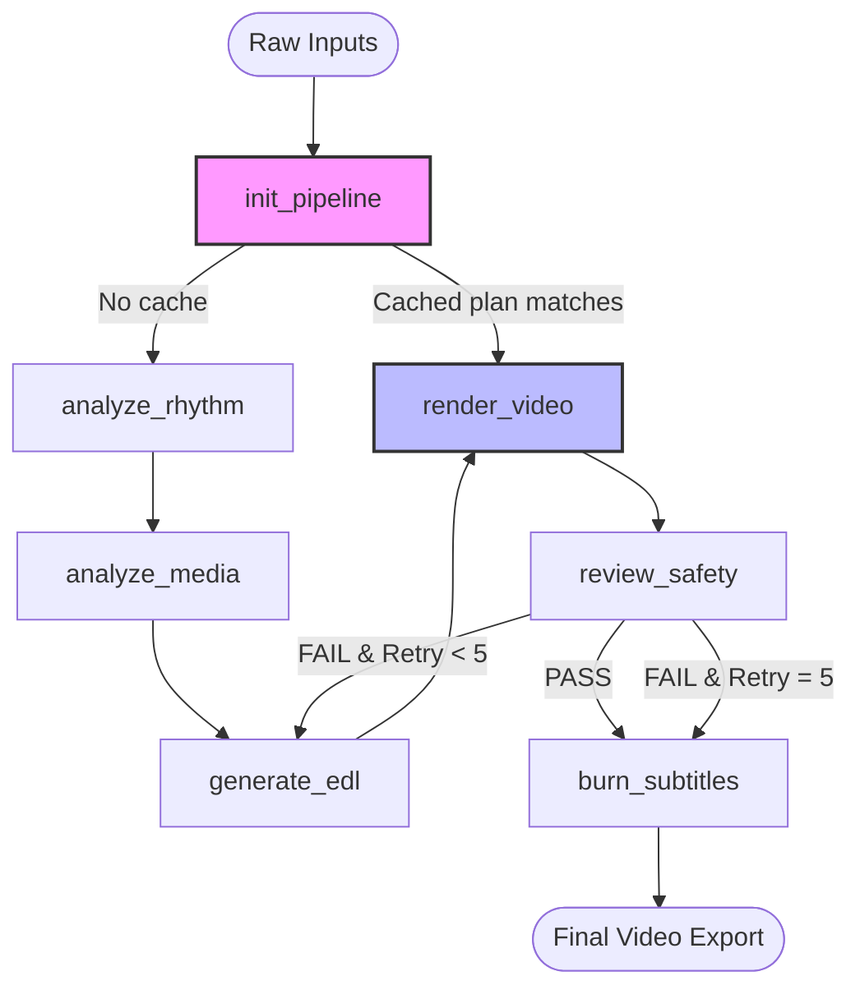

# Shortify AI Backend

Shortify AI is an autonomous, production-grade short-form video generation engine. It transforms raw video footage and a creative brief into edited, color-graded, paced, and captioned videos ready for TikTok, Instagram Reels, and YouTube Shorts.

The system is built on a **LangGraph state machine** that coordinates specialized AI agents, exposed via a **FastAPI** REST API with a PostgreSQL backend.

---

## 📂 Documentation Index

Detailed architectural specs, agent guidelines, and setup details are located under the **[docs/](file:///d:/ME/Shortify_BE/docs/)** folder:

1. **[docs/architecture.md](file:///d:/ME/Shortify_BE/docs/architecture.md) (System Architecture)**: Explains the multi-layer split (FastAPI routers vs. LangGraph), sequence diagram of a render lifecycle request, and orchestrator state machine variables (`AgentState`).
2. **[docs/agents.md](file:///d:/ME/Shortify_BE/docs/agents.md) (AI Agent Directory)**: Explains the roles, models, and options of the 5 agents (Rhythm, Media, Director, Editor, Subtitle), API key rotation, key pinning/ownership details, and the project cache directory structure.
3. **[docs/rendering_pipeline.md](file:///d:/ME/Shortify_BE/docs/rendering_pipeline.md) (Video Compositing Engine)**: Explains the FFmpeg and OpenCV compositing engine, early 30 fps CFR conversion (how it solves variable/high-framerate glitches), speed ramping curves, spatial transitions, and dynamic amix background music ducking.
4. **[docs/database_and_env.md](file:///d:/ME/Shortify_BE/docs/database_and_env.md) (Database Schema & Config)**: Explains the database ERD, SQLAlchemy mappings, detailed configurations, and database reset logic.
5. **[docs/api_reference.md](file:///d:/ME/Shortify_BE/docs/api_reference.md) (API Endpoint Catalog)**: Catalog of routes (Auth, Projects, Media, Audio, Render) and JSON schemas.
6. **[docs/testing.md](file:///d:/ME/Shortify_BE/docs/testing.md) (Testing Guide)**: Explains the automated test suite structure, unit/integration test files, and verification commands.
7. **[docs/error_handling.md](file:///d:/ME/Shortify_BE/docs/error_handling.md) (Error Handling & Fault Tolerance)**: Details Google API rate-limiting, safety self-correction loops, and validation error bypasses.

---

## 🚀 System Architecture



Shortify is separated into two modules:
1. **AI Engine Layer (`backend_ai/`)**: Stateful LangGraph orchestrator, agent actions, media parsing, and video compositing.
2. **Web API Layer (`backend_main/`)**: FastAPI routing, JWT authentication, schema validation, and background worker threads.

Read the detailed [System Architecture Document](file:///d:/ME/Shortify_BE/docs/architecture.md) for sequence flows and state descriptions.

---

## 🛠️ Technology Stack

| Component | Technology | Purpose |
|---|---|---|
| **Web Framework** | FastAPI | REST API endpoints & background thread workers |
| **Orchestration** | LangGraph 1.x | Stateful multi-agent graph execution |
| **Audio Processing** | Librosa | Rhythm beat tracking, tempo, and energy extraction |
| **Video Understanding** | Gemini 1.5 Flash | Semantic video segment analysis |
| **Creative Reasoner** | Groq / Llama 3.3 70B | Timeline composition and JSON EDL planning |
| **Video Engine** | FFmpeg & OpenCV | Sub-clip cuts, speed-ramping, overlays, and transitions |
| **Transcription** | local OpenAI Whisper | Word-level speech-to-text transcription |
| **Database** | PostgreSQL + SQLAlchemy | Relational data persistence |
| **Authentication** | Argon2 + JWT | Secure sessions and password hashing |

---

## 🔄 The Video Generation Pipeline



### 1. Inputs
- **Raw User Video Clips**: User-uploaded mp4 files.
- **Background Music**: Background audio track (mp3/wav).
- **Creative Brief / Prompts**: Narrative style and pacing preferences.

### 2. Steps & Intermediary Results

1. **`init_pipeline`**:
   - Checks if a cached `director_analysis.json` exists under the project's cache path. If found, it loads the plan and fast-tracks execution straight to the rendering node, bypassing analytical API costs.
2. **`analyze_rhythm` (RhythmEngineer)**:
   - Evaluates the background music. Detects tempo (BPM), beat grids, and volume drops.
   - *Intermediary Result*: `music_analysis.json` containing musical timestamps.
3. **`analyze_media` (MediaAnalyst)**:
   - Uploads raw videos to Gemini and runs segment analysis (detecting actions, faces, compositions, and lighting).
   - *Intermediary Result*: `media_analysis.json` detailing frame-by-frame visual metrics.
4. **`generate_edl` (CreativeDirector)**:
   - Combines user inputs, beat grids, and media metrics to structure the timeline.
   - *Intermediary Result*: `director_analysis.json` containing an Edit Decision List (EDL).
5. **`render_video` (VideoEditor)**:
   - Downloads sticker/vfx overlays (Giphy/Pixabay), pre-stabilizes clips, applies color grading LUTs, and merges video sections using spatial transitions and audio ducking.
   - *Intermediary Result*: `render_trek.mp4` (clean video track) and `render_trek_graded.mp4` (color-corrected track).
6. **`review_safety` & `burn_subtitles` (SubtitleAgent)**:
   - Checks overlays against social media safe zones (top header, right buttons, bottom bar). If overlays fail safe-zones, it passes coordinate corrections back to the Creative Director to regenerate the EDL.
   - Whisper transcribes spoken tracks, generates word-level timestamps, and burns captions to the video.
   - *End Result*: `trek.mp4` (Final Dynamic social video).

For code parameters and transition details, read the [AI Agents Document](file:///d:/ME/Shortify_BE/docs/agents.md) and [Video Editing Engine Document](file:///d:/ME/Shortify_BE/docs/rendering_pipeline.md).

---

## ⚙️ Environment Configuration

Create a `.env` file in the project root. The structure must align with `.env.example`:

- **DATABASE_URL**: Connection URI for PostgreSQL database.
- **GEMINI_API_KEY**: Rotation slot keys (supports `GEMINI_API_KEY_1` to `GEMINI_API_KEY_3`) to balance uploads and bypass 429 errors.
- **PIXABAY_APPLY**: Set to `false` to disable Pixabay visual overlay application, preventing overlay downloads.
- **EDL_VALIDATION_FAIL**: Set to `pass` to gracefully proceed with editing if validation checks fail on the 3rd attempt, preventing rendering interruptions.

For database tables and models, read the [Database Schema & Configuration Document](file:///d:/ME/Shortify_BE/docs/database_and_env.md).

---

## 🚀 Running the Project Local Server

1. **Activate Environment & Install dependencies**:
   ```bash
   python -m venv .venv
   .venv\Scripts\activate
   pip install -r requirements.txt
   ```
2. **Reset storage and database**:
   ```bash
   python tests/reset_db.py
   ```
3. **Launch the FastAPI app**:
   ```bash
   python -m fastapi run backend_main/main.py --port 8002
   ```
Interactive API documentation will be available at `http://localhost:8002/docs`.
