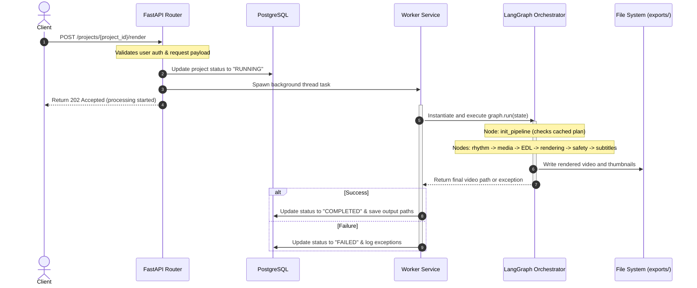
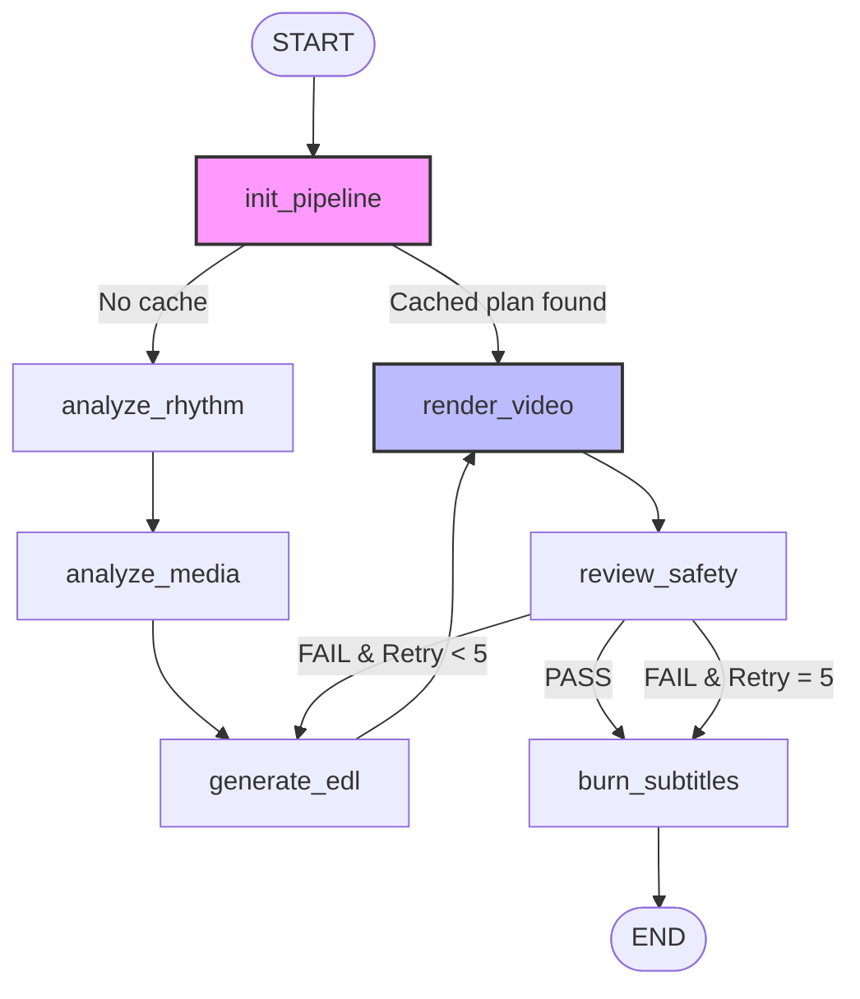

# System Architecture & Flow

This document details the software architecture, the request-rendering lifecycle, and the orchestrator state machine of Shortify AI.

---

## 1. Multi-Layer Structure

Shortify AI is designed with an clean separation between the **Web API Layer** and the **AI Engine Layer**:

```
+--------------------------------------------------------------+
|                      Client Application                      |
+------------------------------+-------------------------------+
                               | HTTP Requests
                               v
+------------------------------+-------------------------------+
|                       Web API Layer                          |
|  - FastAPI HTTP routes (auth, projects, media, render)       |
|  - PostgreSQL Database (SQLAlchemy ORM models & schemas)     |
|  - Background Tasks (Worker Thread Pool Management)          |
+------------------------------+-------------------------------+
                               | Async Process Delegations
                               v
+------------------------------+-------------------------------+
|                       AI Engine Layer                        |
|  - LangGraph State Machine (ShortifyOrchestrator)            |
|  - Rhythm Detection & Analysis (librosa onset/temp)          |
|  - Video Semantics Analysis (Gemini API Flash Model)          |
|  - Storyboarding & Timeline Planning (Llama 3.3 70B model)   |
|  - Video Compositing Engine (FFmpeg & OpenCV wrappers)       |
|  - Whisper Transcription & TikTok Safety Zone Checks         |
+--------------------------------------------------------------+
```

### 1.1 Web API Layer (`backend_main/`)
- **main.py**: Initiates the FastAPI server and aggregates endpoint routers.
- **config.py**: Establishes database engine connections, session factories, logging parameters, and storage paths.
- **models.py**: Defines SQLAlchemy ORM structures for relational schema tracking.
- **schemas.py**: Houses Pydantic v2 schemas for API data contract enforcement.
- **routers/**: Defines modular routers mapping endpoints for authentication, asset upload, project setup, and rendering execution.
- **worker_service.py**: Runs asynchronous background worker threads executing the AI orchestrator graph for render requests, updating DB records to trace pipeline progress (`IDLE`, `RUNNING`, `FAILED`, `COMPLETED`).

### 1.2 AI Engine Layer (`backend_ai/`)
- **orchestrator.py**: Defines the LangGraph workflow structure, entry states, and conditional loop routing.
- **services/**: Houses the code for the independent pipeline agents and processors.
- **effects/**: Modules for OpenCV and FFmpeg rendering, spatial transitions, speed-ramping, text styling, and stabilization logic.
- **core/**: Implements shared clients, Gemini rotators, API key rate-limiting cooldown tracking, and validation tools.

---

## 2. Life of a Render Request

When a client requests a video render:



---

## 3. LangGraph Orchestrator State Machine

The AI video-creation engine is modeled as a state machine using LangGraph. The states represent discrete steps, passing a mutable `AgentState` object across execution boundaries:



### 3.1 State Schema (`AgentState`)
The orchestrator maintains the following global state:

```python
class AgentState(TypedDict):
    # Inputs
    video_paths: List[str]
    music_path: Optional[str]
    project_title: str
    target_duration: float
    aspect_ratio: str
    style: str
    caption_style: str
    
    # Flags & Controls
    add_subtitle: bool
    add_stickers: bool
    add_textoverlay: bool
    has_cached_director: bool
    
    # Intermediary Analysis Outputs
    rhythm_data: Dict[str, Any]
    visual_data: List[Dict[str, Any]]
    edl: Dict[str, Any]
    edl_feedback: str
    
    # Intermediary Render Outputs
    rendered_video_path: str
    safe_zone_report: Dict[str, Any]
    transcription: Dict[str, Any]
    
    # Final Output
    final_video_path: str
    
    # Execution Counter
    retry_count: int
```
